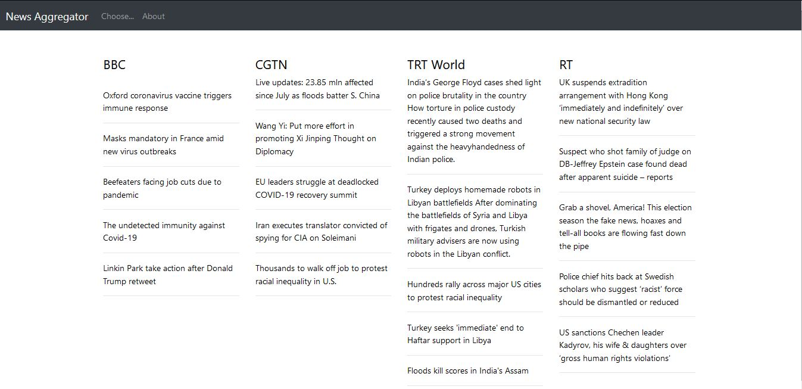

# News Aggregator

[Project Idea](https://realpython.com/intermediate-python-project-ideas/)
 
 
This **News Aggregator** fetches article headings from various Websites and gathers all of that information in one place. Therefore, you don’t have to visit multiple sites to get the latest News: one website is enough.
 

